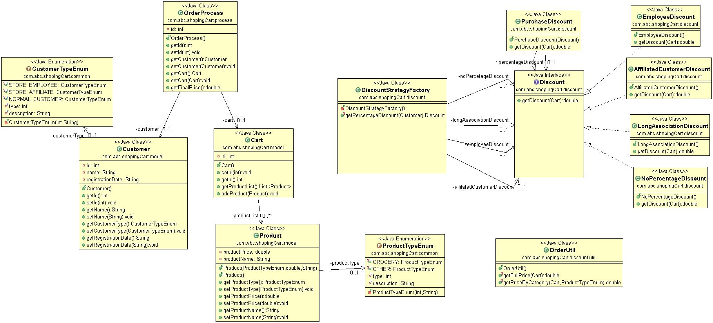

# shopping-cart
Demo Application for applying discount

### Use Case
 For a given shopping cart following discounts would apply based on curstomer type, product and total amount:
 1. If the user is an employee of the store, he gets a 30% discount.
 2. If the user is an affiliate of the store, he gets a 10% discount.
 3. If the user has been a customer for over 2 years, he gets a 5% discount. 
 4. For every $100 on the bill, there would be a $ 5 discount (e.g. for $ 990, you get $ 45 as a discount). 
 5. The percentage based discounts do not apply on groceries. 6. A user can get only one of the percentage based discounts on a bill. 

### How to run the program

##### Prerequisite
  * Java 8+
  * Maven Plugin 
  
##### Steps to Run
  * Download the code.
  * Open Command prompt and go to the downloaded directory.
  * Run -> mvn clean install(This will compile the code build the package, run test cases and generate Junit coverage report )
  * Please refer the Junit test cases for the scenario which has been covered.
  
### Class Diagram

